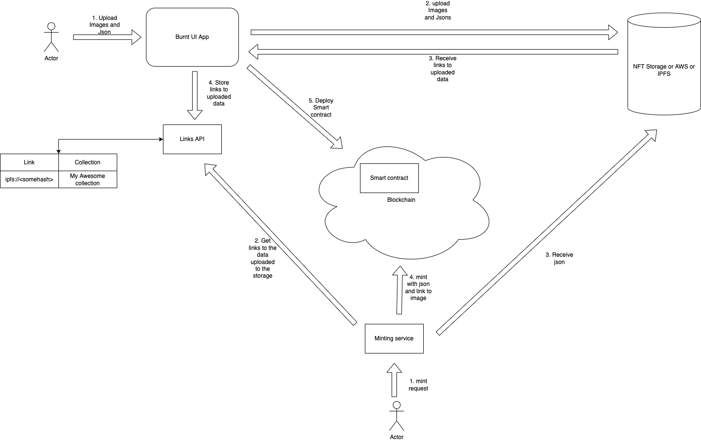
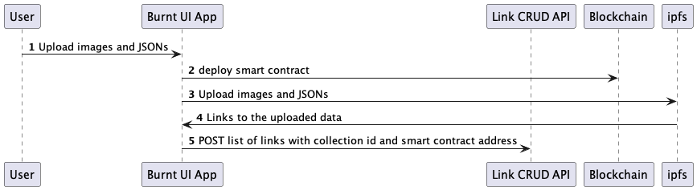
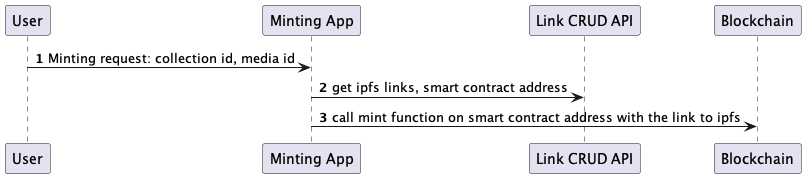

# Burnt links API

The Links API microservice is a service that provides intermediate storage for the links to the uploaded images and jsons of future nft to ipfs/nft-storage/s3.

Using that links later we will be able to mint the actual NFT on any other service.

## Detailed design for Burnt UI interactions

## Detailed design for future mint service interaction

## Service swagger definition:

[swagger.yaml](./docs/swagger.yaml)